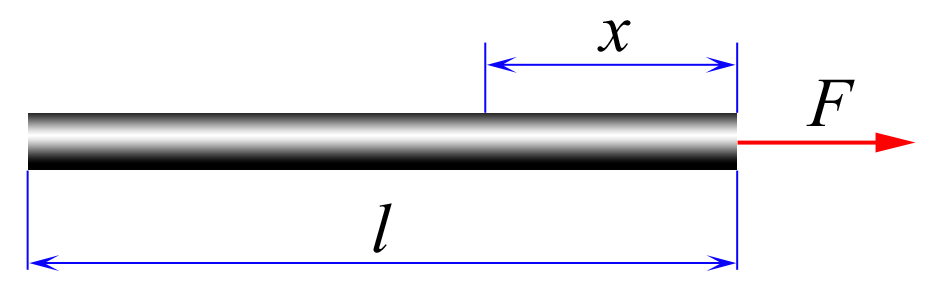
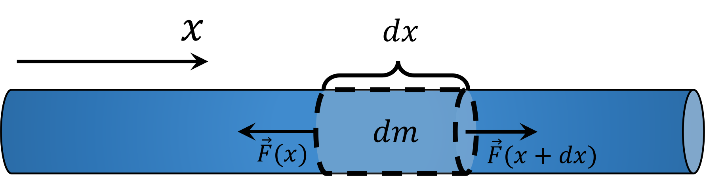

###  Условие:

$2.1.5.$ Какая сила действует в поперечном сечении однородного стержня длины $l$ на расстоянии $x$ от того конца, к которому вдоль стержня приложена сила $F$?

###  Решение:

Если рассматривать стержень массой $m$ как единое целое, то он будет двигаться с ускорением

$$
a = \frac{F}{m}
$$

Т.к. стержень нерасстяжим, то ускорение всех его частей одинаково и равно $a$

Рассмотрим малый участок стержня длины $dx$ и массы $dm$. Т.к. стержень однородный

$$
dm = m \frac{dx}{l}
$$

Запишем второй закон ньютона для этого участка.

$$
a\, dm = F(x+dx) - F(x)\tag{1}
$$

Где $F(x+dx)$ и $F(x)$ сила взаимодействия вместе с соседями

Проинтегрируем выражение $(1)$ по горизонтальной координате $x$:

$$
\int_x^l am\frac{dx}{l} = \int_x^l dF
$$

$$
ma\frac{l-x}{l}
$$

$$
F(x) = \fbox{$F(1-\frac{x}{l})$}
$$

#### Ответ:

$$
\fbox{$T = F(1 − x/l)$}
$$