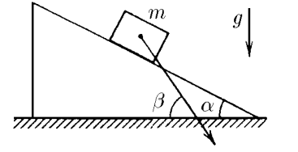
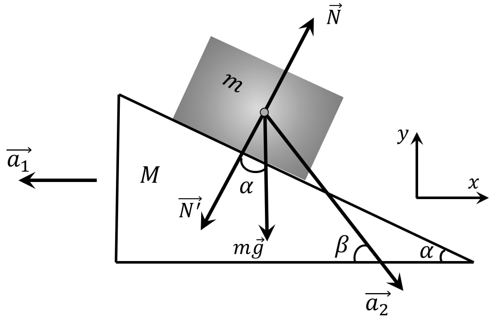
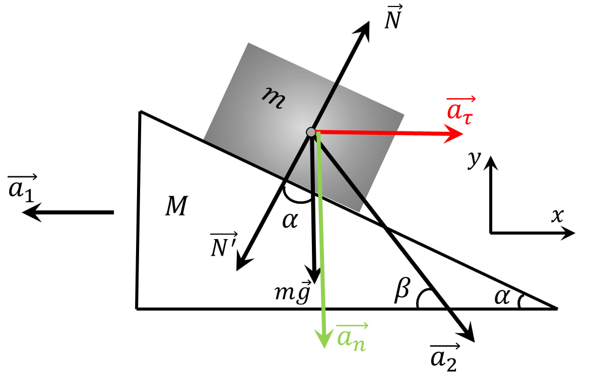
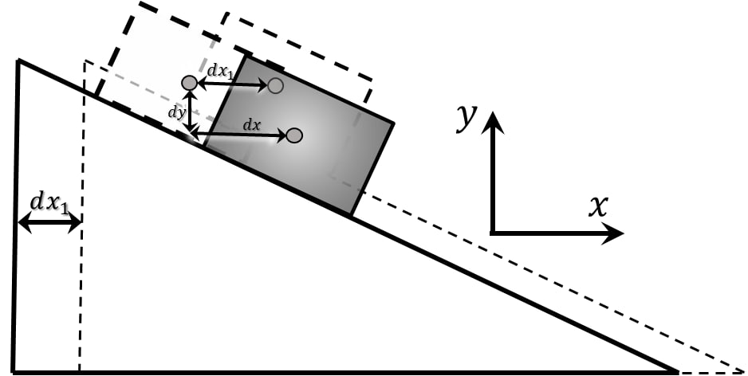

###  Условие:

$2.1.50.$ На гладкой горизонтальной плоскости находится клин с углом $\alpha$ при основании. Тело массы $m$, положенное на клин, опускается с ускорением, направленным под углом $\beta > \alpha$ к горизонтали. Определите массу клина.

###  Решение:

  Силы действующие на систему

Разобьём ускорение бруска $\vec{a}_2$ на нормальную $\vec{a}_n$ и тангенциальную $\vec{a}_\tau$ компоненты

Из рисунка:

$$
a_n=a_2 \cdot \sin\beta
$$

$$
a_\tau =a_2 \cdot \cos\beta
$$

$$
a_n=a_\tau\cdot \tan\beta\tag{0}
$$

Рассмотрим малое изменение координаты клина и бруска на нем за маленький промежуток $dt$: Клин сдвинулся на $dx_1$ Между тем, брусок в системе отсчета связанной с клином, по оси $OX$ брусок сдвинулся на $dx$, а по $OY$ — $dy$

Относительно начальной точки, в СО Наблюдателя, брусок сдвинулся на

$$
OX: \;dx=dx_0+dx_1
$$

$$
OY: \;dy=dy_0
$$

Т.к. брусок не отрывается,

$$
dy=dx \cdot \tan\alpha\tag{a}
$$

Продеффиринцируем дважды обе части выражения $(a)$:

$$
\frac{dy}{d^2t} = \frac{dx}{d^2t} \cdot \tan\alpha
$$

$$
a_n = (a_\tau +a_1) \cdot \tan\alpha\tag{1}!
$$

Запишем второй закон Ньютона для бруска на оси:

$$
OX: \;ma_\tau =N\,\sin\alpha\tag{2}
$$

$$
OY: \;ma_n=mg-N\cos\alpha\tag{3}
$$

По третьему закону Ньютона Сила давления $\vec{N}{}'$ оказаная бруском на клин равна по модулю и проивоположна по направлению силе нормальной реакции опоры $\vec{N}$:

$$
\vec{N}{}'=-\vec{N}
$$

Второй закон Ньютона для клина на оси $OX$:

$$
Ma_1=N\,\sin\alpha\tag{4}
$$

Составим и решим систему уравнений $(0)$, $(1)$, $(2)$, $(3)$ и $(4)$ относительно $M$:

$$
\left\\{\begin{matrix} a_n=a_\tau\cdot \tan\beta& \\\ a_n = (a_\tau +a_1) \cdot \tan\beta& \\\ ma_\tau =N\,\sin\alpha& \\\ ma_n=mg-N\cos\alpha& \\\ Ma_1=N\,\sin\alpha& \end{matrix}\right.
$$

$$
\left\\{\begin{matrix} a_\tau\cdot \tan\beta = (a_\tau +a_1) \cdot \tan\alpha& \\\ ma_\tau =N\,\sin\alpha& \\\ ma_n=mg-N\cos\alpha& \\\ Ma_1=N\,\sin\alpha& \end{matrix}\right.
$$

$$
M=ma_\tau\cdot \frac{1}{a_1}
$$

$$
a_\tau (\tan\beta -\tan\alpha ) = a_1\,\tan\alpha
$$

$$
\frac{a_\tau}{a_1} = \frac{\tan\alpha}{\tan\beta -\tan\alpha}
$$

$$
M=m \frac{a_\tau}{a_1}
$$

$$
\boxed{M=m \frac{\tan\alpha}{\tan\beta -\tan\alpha}}
$$

###  Ответ:

$$
M= m \frac{\tan\alpha}{\tan\beta -\tan\alpha}
$$