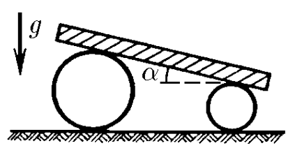
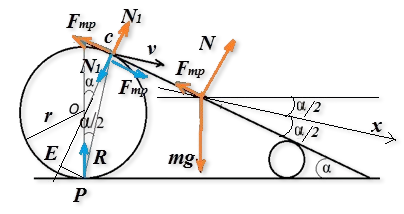

###  Условие:

$2.1.51.$ На два катка разного радиуса положили тяжелую плиту. Она образует угол $\alpha$ с горизонтом. Найдите ускорение этой плиты. Проскальзывания нет. Массой катков пренебречь.

###  Решение:

Движение плиты сложное, состоит из горизонтального (за счет движения катков) и под углом к горизонту, и является поступательным. Расставим силы.

Векторы синим цветом - это силы, действующие на каток ($N_1$ - сила со стороны плиты на каток она равна и противоположно направлена силе со стороны катка на плиту, $F_{тр}$ - сила трения, действующая на каток (под ее действием происходит вращение катка), и сила реакции опоры $R$ в точке $P$).

Аналогичные силы действуют на каток меньшего радиуса. Векторы красного цвета обозначают силы, действующие на плиту ($N$ - суммарная сила реакций опор, $mg$ - сила тяжести, $F_{тр}$ - сила трения со стороны катков на плиту).

Выберем ось $Ox$ по направлению скорости движения плиты. Сама же скорость это мгновенная скорость точки касания плиты и катка, а точка $P$ - мгновенный центр скоростей, причем $v$ перпендикулярна $PC$ (мгновенный радиус вращения). Запишем в проекциях на ось $Ox$ уравнение движения плиты

$$
ma = mg \sin a/2 + N \sin\alpha /2 - F_{тр} \cos\alpha /2\; (1)
$$

В этом уравнении три неизвестных. Необходимо составить еще уравнения.

Запишем уравнение вращательного движения для катка. Это уравнение имеет вид

$$
I \varepsilon = \Sigma M
$$

произведение момента инерции тела на угловое ускорение равно сумме моментов сил, действующих на тело. Найдем плечи сил, действующих на каток $PC$

$$
2r \cos\frac{\alpha}{2}
$$

Плечо силы трения равно

$$
2r \cos^2 \frac{\alpha}{2}
$$

а плечо силы $N$ равно

$$
2r\cos\frac{\alpha}{2} \cdot \sin\alpha /2
$$

Плечо силы $R$ равно нулю.

Запишем уравнение вращательного движения для катка (т.к. масса катка по условию задачи равна нулю, то и $I = 0$):

$$
0 = - F_{тр} 2r \cos^2 \frac{\alpha}{2} + N r \sin\alpha\; (2)
$$

Откуда

$$
F_{тр}= N \tan\frac{\alpha}{2}
$$

подставляя это значение в уравнение движения $(1)$, получим

$$
ma = mg \sin\frac{\alpha}{2}
$$

т.е. искомое ускорение равно

$$
\boxed{a = g \sin\alpha /2}
$$

###  Ответ:

$$
a = g \sin(\alpha /2)
$$

###  Альтернативное решение:

