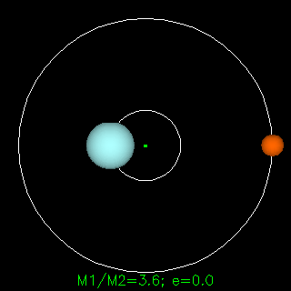

###  Условие: 

$2.1.52.$ Ускорение звезд, входящих в состав двойной звезды, $a_1$ и $a_2$. Какова масса второй звезды, если масса первой $m_1$? 

###  Решение: 

Т.к. система является замкнутой, то отсутствуют внешние силы 

Соответственно, центр масс системы не имеет ускорения $$a_C = 0\quad(1)$$ Учитывая, что $\vec{a_1}$ и $\vec{a_2}$ направлены в разные стороны, ускорение центра масс системы описывается выражением $$a_C = \frac{m_1a_1-m_2a_2}{m_1+m_2}$$ Учитывая соотношение $(1)$ $$m_1a_1=m_2a_2$$ Откуда, масса второй звезды $$\boxed{m_2 = m_1 \frac{a_1}{a_2}}$$ 

###  Ответ: 

$$m_2 = m_1 \frac{a_1}{a_2}$$ 
