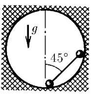

###  Условие:

$2.1.53.$ В сферическую полость поместили гантель (два шарика массы $m$ каждый, соединенные невесомым стержнем) так, как это показано на рисунке. Определите силу давления шариков на стенки сразу же после того, как гантель отпустили. Радиус шариков гантели много меньше радиуса сферы.

###  Решение

### Примечание
1. В условии не хватает информации о том, что шарики изначально находятся на горизонтальном и вертикальном диаметрах. Из оригинального рисунка это не совсем понятно.

2. Важно понять, что о равноускоренном движении речи не идет. Ускорение шариков будет меняться с течением времени, поскольку приложенные к шарикам силы будут менять и свое направление, и величину. Это не мешает, однако, записать второй закон Ньютона с использованием мгновенного ускорения для начальной ситуации.

3. Еще важнее понять, что ускорения шариков могут быть направлены по-разному относительно стержня.

4. Полное ускорение есть векторная сумма тангенциального и нормального ускорений. Нормальное ускорение (оно же центростремительное) в момент начала движения $(v=0)$ равно нулю, поскольку $a_n=\frac{v^2}{R}.$ Значит, полное ускорение совпадает с тангенциальным, то есть направлено по касательной к траектории, которой является граница полости. Таким образом, в начале движения мгновенное ускорение верхнего шарика направлено вертикально вниз, а ускорение нижнего шарика — горизонтально влево.

5. Поскольку шарики соединены стержнем постоянной длины,
проекции их мгновенных скоростей на стержень должны быть одинаковы:

$$
v_1\cos\alpha=v_2\sin\alpha
$$

$$
v_1=v_2\tan\alpha
$$

Угол $\alpha$ не меняется при движении стержня и всегда равен $45^\circ.$
Значит, в момент начала движения и проекции тангенциальных ускорений на стержень равны:
$a_1=a_2\tan\alpha.$ Строго говоря, это следует из дифференцирования уравнения
$v_1=v_2\tan\alpha$ по времени.
Угол $\alpha=45^\circ,$ значит, тангенциальные ускорения шариков одинаковы по модулю.

В процессе движения у ускорений появится центростремительная компонента, но тангенциальные ускорения всегда будут равны по модулю. Уравнения (2) и (4) из исходной системы учитывают, что в начале движения центростремительная компонента ускорения равна нулю.

6. При желании можно показать, что и полные ускорения шариков будут равны при $\alpha=45^\circ.$
Однако отношение полных ускорений не равно $\tan\alpha.$

7. Поговорим о силах реакции $F_1$ и $F_2,$ действующих со стороны стержня на шарики.
Попробуйте ответить на вопрос: почему они равны и направлены вдоль стержня?
Для этого надо рассмотреть парные по третьему закону Ньютона силы $F'_1$ и $F'_2,$
действующие со стороны шариков на стержень. Эти силы должны компенсировать друг друга, иначе невесомый стержень $(m_{ст}=0)$ будет иметь бесконечно большое ускорение:

$$
m_{ст}\kern1pt\vec a_{ст} = \vec{F}'_1 - \vec{F}'_2
$$

Также эти силы должны быть направлены вдоль стержня, иначе из-за нескомпенсированного момента сил невесомый стержень приобретет бесконечно большое угловое ускорение.