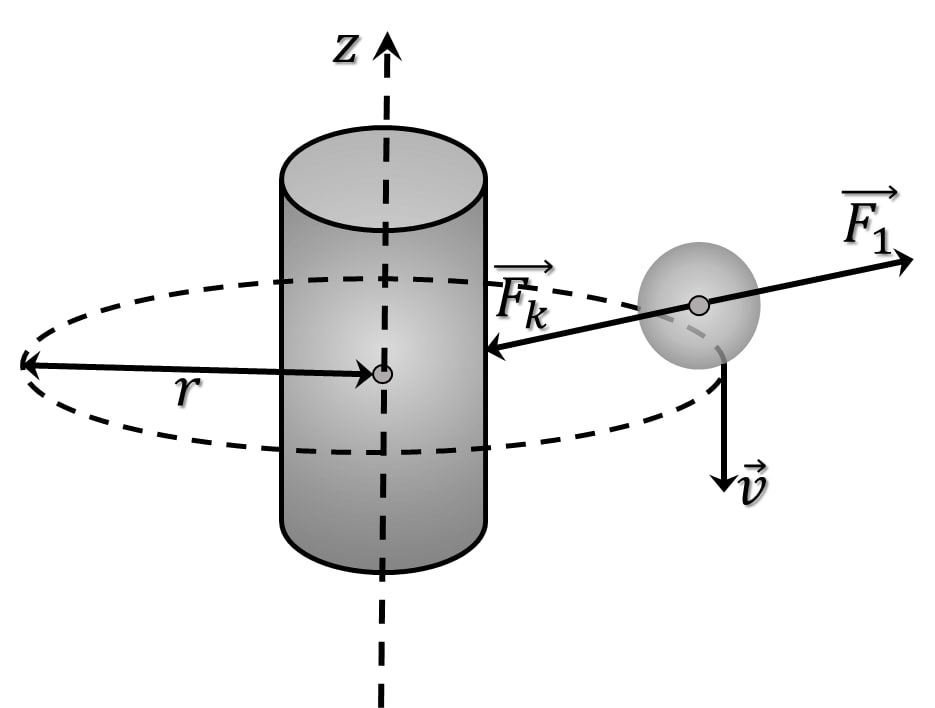

###  Условие:

$2.1.54.$ Электроны, движущиеся по окружности любого радиуса вокруг заряженной нити, имеют одну и ту же скорость $v$. Масса электрона $me$. Как зависит сила, действующая со стороны нити на электрон, от расстояния между электроном и нитью? Опишите качественно начальный отрезок траектории, по которой будет двигаться электрон, если скорость его при движении по окружности станет вдруг чуть меньше $v$? чуть больше $v$?

###  Решение:

1\. Стационарная круговая орбита электрона, представляющего собой отрицательно заряженную частицу с массой покоя $m_e$, будет иметь место в случае равенства по модулю кулоновской силы притяжения и силы инерции

$$
F_k=F_i
$$

2\. Сила инерции прямо пропорциональна квадрату линейной скорости частицы и обратно пропорциональна расстоянию до оси вращения

$$
F_i=\frac{m_ev^2}{r}
$$

Таким образом, сила Кулона в данном случае обратно пропорциональна расстоянию между электроном и заряженной нитью. 3\. При увеличении заряда нити

$$
\boxed{F_k>\frac{m_ev^2}{r}}
$$

для восстановления равновесия радиус орбиты должен уменьшится, при уменьшении заряда наоборот, радиус увеличится.

###  Ответ:

$$
F = mev^2/r
$$

Близки к параболам, касающимся окружности изнутри; снаружи.