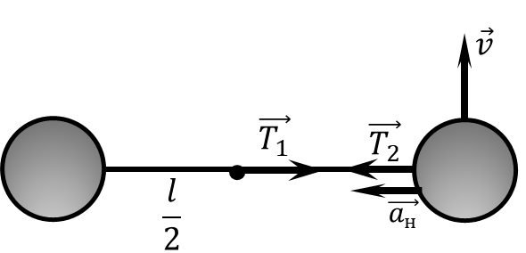

###  Условие: 

$2.1.55.$ Два шарика массы $m$ каждый, связанные нитью длины $l$, движутся со скоростью $v$ по горизонтальному столу в направлении, перпендикулярном к связывающей их нити (нить не провисает). Середина нити налетает на гвоздь. Чему равна сразу после этого сила натяжения нити? 

###  Решение: 

Т.к. нить не провисает $$T_1 = T_2 = T$$ Как только появляется гвоздь, оба тела продолжают двигаться со скоростью $v$ по новой траетории $r=\frac{l}{2}$ $$T=ma_н$$ $$T=m\frac{v^2}{\frac{l}{2}}$$ Получаем силу натяжения нити сразу после этого $$\boxed{T = \frac{2m v^2}{l}}$$ 

###  Ответ: 

$$T = \frac{2m v^2}{l}$$ 
