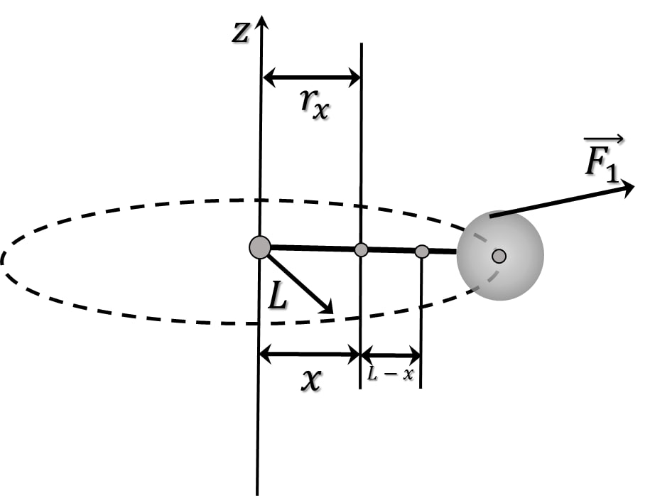

###  Условие:

$2.1.56.$ Тело массы $M$ связано нитью длины $l$ с осью, вокруг которой оно обращается с угловой скоростью $\omega$. Найдите силу натяжения нити. Размеры тела малы, силой тяжести пренебречь. Замените нить однородной веревкой массы $m$ и найдите силу ее натяжения на расстоянии $x$ от оси вращения.

###  Решение:

1\. В случае невесомой и нерастяжимой нити её натяжение определится как:

$$
T=F_i=\frac{mv^2}{L}=\frac{m\omega^2L^2}{L}
$$

$$
\boxed{T=m\omega^2L}
$$

2\. Выделим заданное сечение верёвки и определим массу её части длиной $(L-x)$

$$
m_x=m\frac{L-x}{L}
$$

3\. Определим расстояние от оси вращения $Oz$ до центра масс отрезка верёвки

$$
r_x=L-\frac{L-x}{2}
$$

$$
r_x=\frac{L+x}{2}
$$

4\. Натяжение верёвки в сечении $х$ будет обусловлено вращающейся массой $M$ и массой верёвки $m_x$

$$
\boxed{T=M\omega^2L+\frac{m\omega^2(L^2-x^2)}{2L}}
$$

###  Ответ:

$$
T = M\omega^2l
$$

$$
T_x = M\omega^2l + m\omega^2(l^2 − x^2)/(2l)
$$