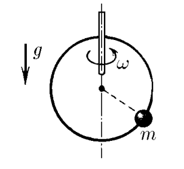
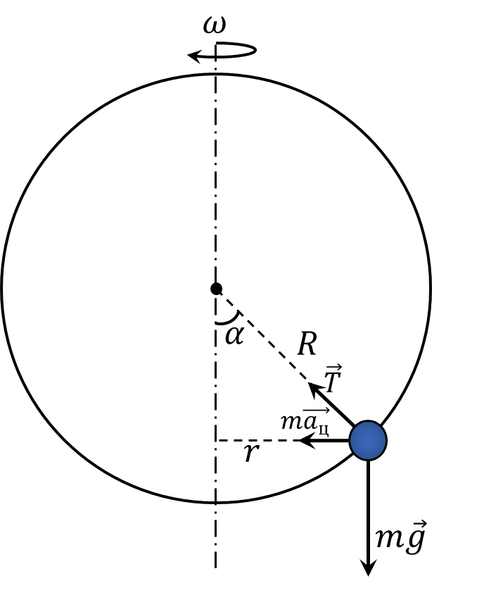

###  Условие: 

$2.1.57.$ На гладкое проволочное кольцо радиуса $R$, расположенное вертикально, надета маленькая бусинка. Кольцо вращается с угловой скоростью $\omega$ вокруг вертикальной оси, проходящей по диаметру кольца. Где находится бусинка? 

###  Решение: 

  Силы, действующие на кольцо 

Проецируя силу натяжения нити $T$, записываем второй закон Ньютона на вертикальную и горизонтальную оси: $$T \sin\alpha = ma_{ц}$$ $$mg - T \cos\alpha = 0$$ Отсюда $$mg \tan\alpha = ma_{ц}\tag{1}$$ Найдем центростремительное ускорение через угловую скорость вращения $\omega$ $$a_{ц} = \omega^2 r = \omega^2 R \sin\alpha$$ Подставляем в $(1)$ $$g = \omega^2 R \cos\alpha$$ Откуда находим $\alpha$ $$\boxed{\cos\alpha = \frac{g}{\omega^2 R}}$$ Учитывая область определения косинуса $$-1 \leq \cos\alpha\leq 1$$ При $g > \omega^2 R$, угловой скорости уже не будет хватать, чтобы поднять тело на какой-то угол и тело займет устойчивое положение в низшей точке своей траектории, соответствующей $$\boxed{\alpha = 0}$$ 

###  Ответ: 

$\cos\alpha = g/(\omega^2 R)$ при $g/(\omega^2 R) < 1;$ 

$\alpha = 0$ при $g/(\omega^2 R) > 1$ 
