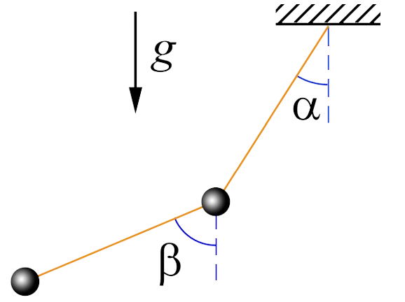
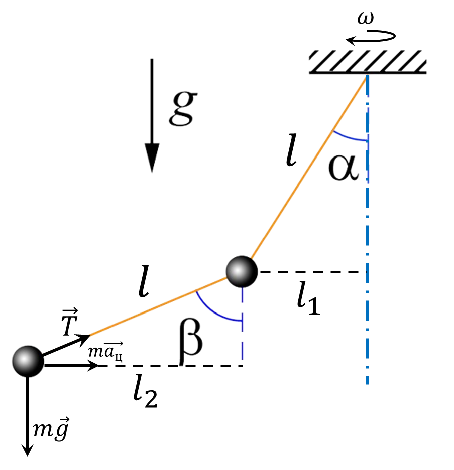

###  Условие: 

$2.1.58.$ К тяжелому шарику, подвешенному на нити длины $l$, подвешен второй тяжелый шарик на нити той же длины. При вращении шариков вокруг вертикальной оси, проходящей через верхнюю точку подвеса, обе нити лежат в одной плоскости и составляют с вертикалью постоянные углы $\alpha$ и $\beta$. Найдите угловую скорость вращения шариков. 

###  Решение: 

Проецируя силу натяжения нити $T$ для нижнего шарика, записываем второй закон Ньютона на вертикальную и горизонтальную оси: $$T \sin\beta = ma_{ц}$$ $$mg - T \cos\beta = 0$$ Отсюда $$mg \tan\alpha = ma_{ц}\tag{1}$$ Найдем центростремительное ускорение через угловую скорость вращения $\omega$ $$a_{ц} = \omega^2 r = \omega^2 (l_1+l_2)$$ $$a_{ц} = \omega^2 l(\sin\alpha + \sin\beta )$$ Подставляем в $(1)$ $$g \tan\alpha = \omega^2 l(\sin\alpha + \sin\beta )$$ Откуда находим $\omega$ $$\boxed{\omega = \sqrt{ \frac{g \, \tan\beta} {l(sin \beta + \sin\alpha )} }}$$ 

###  Ответ: 

$$\omega = \sqrt{ \frac{g \, \tan\beta} {l(sin \beta + \sin\alpha )} }$$ 
