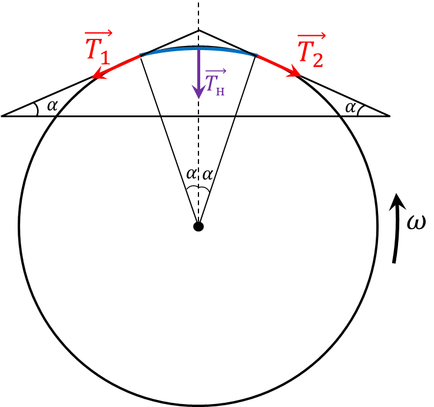

###  Условие:

$2.1.60^*.$ Из тонкого резинового жгута массы $m$ и жесткости $k$ сделали кольцо. Это кольцо раскрутили вокруг его оси. Найдите новый радиус кольца, если угловая скорость его вращения равна $\omega$, а радис равен$R$

###  Решение:

Рассмотрим маленький кусочек жгута длины $dl = 2\alpha R$

На кусочек жгута действуют силы натяжения

$$
T_1 = T_2 = 2k\alpha (R-R_0)
$$

При учитывая $\sin\alpha\approx \alpha$ при малых углах

$$
T_{н} = 2T\alpha
$$

В силу однородности жгута, кусочек длины $dl = 2\alpha R$ будет иметь массу

$$
dm = m \frac{\alpha}{\pi}
$$

При этом на него будет действовать ценстростремительное ускорение

$$
a = \omega^2 R
$$

Второй закон Ньютона запишем как

$$
dma = T_{н}
$$

$$
m \frac{1}{\pi} \omega^2 R = 4k (R-R_0)\alpha
$$

Откуда находим $R$

$$
\boxed{R = \frac{R_0}{1 − m \omega^2 /4 \pi^2 k}}
$$

Анализируя полученное полученное выражение, при $R< R_0$ будет действовать результирующая сила упругости $\vec{T}_{н}$ направленная на расстяжение, которое не будет компенсировать центробежной силой. Таким образом, жгут будет бесконечно растягиваться и в конечном счёте разорвётся.

#### Ответ:

$R = R_0/(1 − m \omega^2 /4 \pi^2 k)$ при $\omega < 2\pi\sqrt{k/m};$

при $\omega\geq 2\pi\sqrt {k/m}$ кольцо неограниченно растягивается

###  Альтернативное решение:

