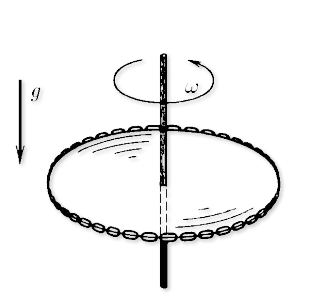
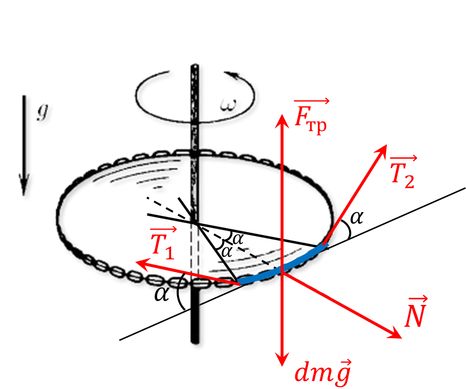

###  Условие:

$2.1.61^*.$ Кольцевая цепочка массы $m$ надета на горизонтальный диск радиуса $R$. Сила натяжения надетой цепочки $T$. Найдите коэффициент трения между диском и цепочкой, если при вращении диска с угловой скоростью, равной или превышающей $\omega$, цепочка с него спадает.

###  Решение:

Для начала, советую ознакомиться с решением [2.1.60](../2.1.60)

Рассмотрим маленький кусочек жгута длины $dl = 2\alpha R$

На кусочек жгута действует сила трения $\vec{F}_{тр}$

$$
F_{тр} = \mu N
$$

В силу однородности жгута, кусочек длины $dl = 2\alpha R$ будет иметь массу

$$
dm = m \frac{\alpha}{\pi}
$$

При этом на него будет действовать ценстростремительное ускорение

$$
a = \omega^2 R
$$

Второй закон Ньютона запишем как

$$
dma = N
$$

$$
m \frac{\alpha}{\pi} \omega^2 R = N
$$

Откуда сила трения

$$
F_{тр} = \mu m \frac{\alpha}{\pi} \omega^2 R
$$

Учитывая $\sin\alpha\approx \alpha$ при малых углах, запишем условие равновесия на вертикальную ось

$$
2T\alpha + F_{тр} = dm\,g
$$

$$
2T\alpha + \mu m \frac{\alpha}{\pi} \omega^2 R = mg \frac{\alpha}{\pi}
$$

Откуда находим $\mu$

$$
\boxed{\mu = \frac{mg}{2 \pi T - m \omega^{2} R}}
$$

#### Ответ:

$$
\mu = \frac{mg}{2 \pi T - m \omega^{2} R}
$$

###  Альтернативное решение:

