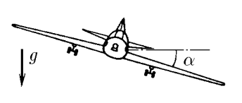

###  Условие:

$2.1.62^*.$ Самолет совершает вираж, двигаясь по горизонтальной окружности радиуса $R$ с постоянной скоростью $v$. Какой угол составляет плоскость крыльев самолета с горизонтом?

###  Решение:

###  Ответ:

$$
\alpha = \arctan \frac{v^2}{Rg}
$$