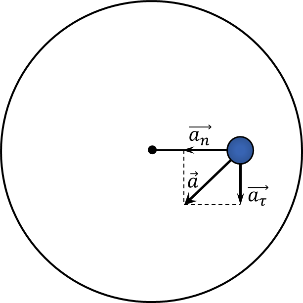

###  Условие:

$2.1.63.$ Горизонтальный диск начинают раскручивать вокруг его оси с линейно возрастающей во времени угловой скоростью $\omega = \varepsilon t$. При какой угловой скорости тело, расположенное на расстоянии $r$ от оси диска, начнет соскальзывать с него, если коэффициент трения между ними равен $\mu$?

###  Решение:

Из-за того, что угловая скорость меняется, помимо центростремительной скорости $a_{н}$ будет также присутствовать тангенциальное ускорение $a_\tau$

По теореме Пифагора найдем общее ускорение $\vec{a}$

$$
a = \sqrt{a_n^2+a_\tau^2}
$$

$$
a = \sqrt{(\omega^2 R)^2+(\varepsilon R)^2}
$$

$$
a = \varepsilon R \sqrt{1 + \varepsilon ^2 R^4}
$$

Второй закон Ньютона запишем как

$$
ma = F_{тр}
$$

$$
ma = \mu mg
$$

$$
\varepsilon R \sqrt{1 + \varepsilon ^2 R^4} = \mu g
$$

Это равенство выполниться при

$$
t = \sqrt{\frac{\mu^2 g^2}{\beta^4 R^2} - \frac{1}{\beta^2}}
$$

Откуда находим $\omega$

$$
\boxed{\omega = \sqrt[4]{\frac{\mu^2 g^2}{R ^2} − \varepsilon ^2)}}
$$

При этом, если $\varepsilon > \mu g/R$, то $a_\tau$ будет настолько большим, что сила трения покоя будет моментально переходить в силу трения скольжения, даже когда $a_n = 0$

###  Ответ:

$\omega_1 = 0$ при $\varepsilon > \mu g/R;$

$\omega_1 = {(\mu^2 g^2 / R^2 − \varepsilon ^2)}^{1/4}$ при $\varepsilon < \mu g/R$