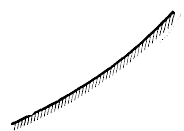
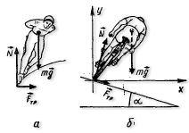

###  Условие:

$2.1.65.$ Конькобежец на ледяной дорожке старается пройти вираж как можно ближе к внутренней бровке. Велосипедист на велотреке, наоборот, проходит вираж возможно дальше от внутренней бровки. Как объяснить это различие в тактике прохождения виража? Профиль велотрека все круче по мере удаления от внутренней его бровки.

###  Решение:

Конькобежцу сообщает центростремительное ускорение сила трения о лед

$$
\vec{F}_{тр}= \mu\vec{N}
$$

где $\vec{N}$ — сила нормальной реакции льда (рис. а).

Так как конькобежец не перемещается в вертикальном направлении, то сила $\vec{N}$ равна по модулю действующей на конькобежца силе тяжести $M \vec{g}$

Поэтому

$$
F_{тр}=\mu mg
$$

$$
\frac{mv^{2}}{R}=\mu mg
$$

Отсюда

$$
v=\sqrt{\mu gR}
$$

Делая поворот, конькобежец проходит расстояние

$$
S= \pi R
$$

за время

$$
t=\frac{s}{v}=\pi\sqrt{\frac{R}{\mu g}}\tag{1}
$$

Чем больше радиус окружности, по которой движется конькобежец, тем больше это время.

Хотя с увеличением радиуса поворота растет максимальная скорость конькобежца, еще больше увеличивается проходимое им расстояние: в то время как скорость пропорциональна $\sqrt{R}$, пройденное расстояние пропорционально $R$. Именно поэтому конькобежец и старается пройти поворот как можно ближе к внутренней бровке.