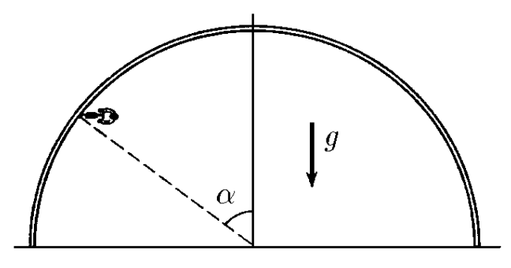

###  Условие: 

$2.1.66^*.$ В цирковом аттракционе мотоциклист движется по внутренней поверхности сферы радиуса $R$. Разогнавшись, он начинает описывать горизонтальную окружность в верхней полусфере. После этого для большего эффекта нижнюю полусферу убирают. Определите минимальную скорость мотоциклиста, если коэффициент трения шин о поверхность сферы равен $\mu$, а угол между вертикалью и направлением к мотоциклисту из центра сферы равен $\alpha$. 

###  Решение: 

 

###  Ответ: 

$$v_{\mathrm{мин}}=\sqrt{\frac{Rg\sin\alpha (\mathrm{tg}\alpha +\mu )}{\mu\operatorname{tg}\alpha -1}}$$ 
