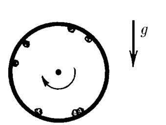

###  Условие:

$2.1.67^*.$ С какой угловой скоростью должен вращаться вокруг своей оси горизонтально расположенный цилиндр, чтобы мелкие частицы внутри цилиндра не соскальзывали с его поверхности? Коэффициент трения между поверхностью цилиндра и частицами равен $1$, внутренний радиус цилиндра $R$.

###  Решение:

По второму закону Ньютона имеем

$$
m \omega^{2}r = N + mg \sin\alpha
$$

где $N$ — сила нормального давления.

Чтобы не было проскальзывания, должно выполняться условие

$$
mg \cos\alpha\leq k(m \omega^{2} r - mg \sin\alpha )
$$

откуда

$\omega^{2} \geq \frac{g}{r} ( \cos\alpha + \sin\alpha )$ при $k=l$.

Таким образом,

$$
\boxed{\omega_{min} = \sqrt{\sqrt{2} g/r}}
$$

###  Ответ:

$$
\omega_{min} = \sqrt{\sqrt{2} g/r}
$$