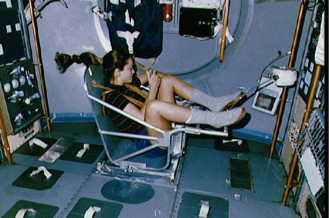

###  Условие: 

$2.1.7.$ Для измерения массы космонавта на орбитальной станции используется подвижное сиденье известной массы $m_0$, прикрепленное к пружине. При одной и той же начальной деформации (сжатии) пружины пустое сиденье возвращается в исходное положение через время $t_0$, если же на сиденьи находится космонавт — через время $t > t_0$. Какова масса космонавта? 

###  Решение: 

Запишем второй закон Ньютона с космонавтом $$kx_2 = (m_0 + m) a_2$$ И с пустым креслом $$kx_1 = m_0 a_1$$ Учтем равноускоренное движение $$\left\\{\begin{matrix} k \frac{a_1t_0^2}{2} = m_0 a_1\\\ k \frac{a_2t^2}{2} = (m_0+m) a_2 \end{matrix}\right.$$ Из первого уравнения $$k = \frac{2m_0}{t_0^2}$$ Подставляем во второе $$\fbox{$m = m_0(\frac{t^2}{t^2_0} − 1)$}$$ 

####  Ответ: 

$$m = m_0[(t/t_0)^2 − 1]$$

  

