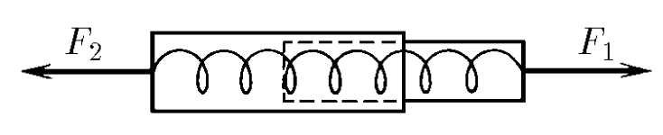
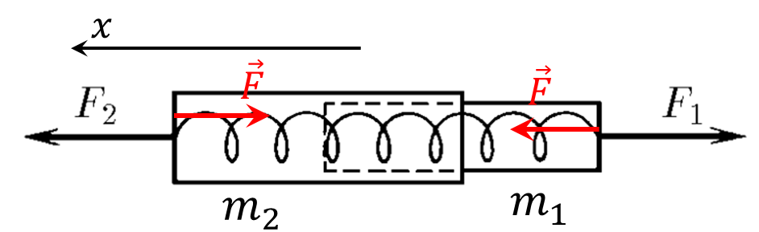

###  Условие:

$2.1.8.$ Динамометр состоит из двух цилиндров, соединенных легкой пружиной. Найдите отношение масс этих цилиндров, если при приложенных к ним силам $F_1$ и $F_2$ динамометр показывает силу $F$

###  Решение:

Запишем второй закон Ньютона для горизонтальной оси $Ox$

$$
\left\\{\begin{matrix} F_2 - F = m_2 a\\\ F-F_1=m_1a \end{matrix}\right.
$$

Отсюда выражаем отношение масс

$$
\fbox{$\frac{m_2}{m_1} = \frac{F_2 - F}{F - F_1}$}
$$

####  Ответ:

$$
\frac{m_2}{m_1} = \frac{F_2 - F}{F - F_1}
$$