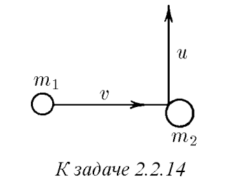
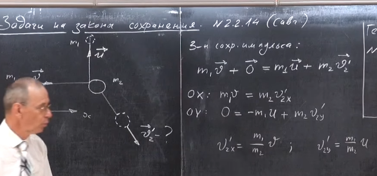
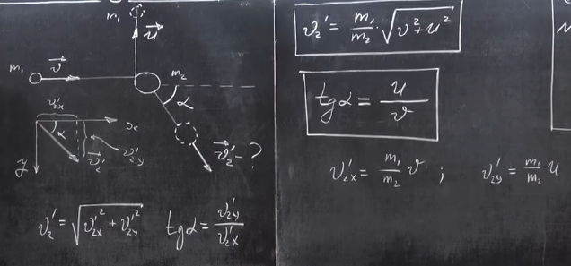

###  Условие: 

$2.2.14^{∗}.$ Частица массы $m_1$, имеющая скорость $v$, налетела на покоящееся тело массы $m_2$ и отскочила от него со скоростью $u$ под прямым углом к направлению первоначального движения. Какова скорость тела массы $m_2$? 

 

###  Решение: 

Запишем закон сохранения импульса:  $m_1\vec v = m_1\vec u + m_2 \vec v_2$ $\vec v_2 = \frac{m_1}{m_2}[\vec v - \vec u]$  так как $\vec v $ и $\vec u $ перпендикулярны, то в скалярном виде будет (по т. Пифагора):  $v_2 = \frac{m_1}{m_2}\sqrt{v^2+u^2}$ 

###  Аналогичное решение: 

 

 

 

###  Ответ: $ w = \frac{m_1}{m_2} \sqrt{u^2 + v^2}$ 
