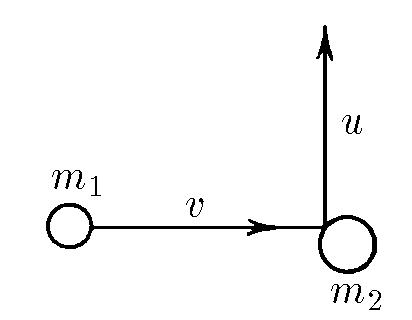

###  Условие:

$2.2.14^{∗}.$ Частица массы $m_1$, имеющая скорость $v$, налетела на покоящееся тело массы $m_2$ и отскочила от него со скоростью $u$ под прямым углом к направлению первоначального движения. Какова скорость тела массы $m_2$?

###  Решение:

Запишем закон сохранения импульса:

$$
m_1\vec v = m_1\vec u + m_2 \vec v_2
$$

Перепишем как разность векторов:

$$
\vec v_2 = \frac{m_1}{m_2}\left[\vec v - \vec u\right]
$$

Так как $\vec v \perp \vec u $, то в скалярном виде будет (по т. Пифагора):

$$
v_2 = \frac{m_1}{m_2}\sqrt{v^2+u^2}
$$

###  Альтернативное решение:

###  Ответ: $ w = \frac{m_1}{m_2} \sqrt{u^2 + v^2}$