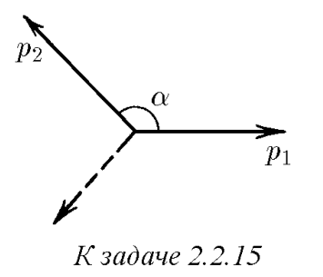

###  Условие: 

$2.2.15.$ При $\beta$-распаде покоящегося первоначально нейтрона образуются протон, электрон и нейтрино. Импульсы протона и электрона $p_1$ и $p_2$, угол между ними $\alpha$. Определите импульс нейтрино 

###  Решение: 

Запишем закон сохранения импульса:  $\vec p_1 + \vec p_2 +\vec p_3 = 0$  по т. косинусов сложим $p_1$ и $p_2$:  $|\vec p_1 + \vec p_2| $$= \sqrt{{p_1}^2+{p_2}^2 -2p_1p_2\cos (\pi - \alpha )} $ $|\vec p_1 + \vec p_2| $$= \sqrt{{p_1}^2+{p_2}^2 + 2p_1p_2\cos (\alpha )}$  угол берём $\pi - \alpha$ так как при сложении угол будет смежный с $\alpha$ 

###  Ответ: $\sqrt{{p_1}^2+{p_2}^2 + 2p_1p_2\cos (\alpha )}$ 
