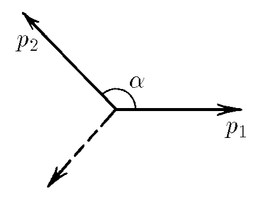

###  Условие:

$2.2.15.$ При $\beta$-распаде покоящегося первоначально нейтрона образуются протон, электрон и нейтрино. Импульсы протона и электрона $p_1$ и $p_2$, угол между ними $\alpha$. Определите импульс нейтрино

###  Решение:

Согласно закону сохранения импульса, сумма векторных импульсов всех частиц должна равняться нулю:

\[
\vec{p}_1 + \vec{p}_2 + \vec{p}_3 = 0.
\]

Отсюда следует, что:
\[
\vec{p}_3 = - (\vec{p}_1 + \vec{p}_2).
\]

Для нахождения модуля суммы двух векторов воспользуемся теоремой косинусов. Угол между векторами \(\vec{p}_1\) и \(\vec{p}_2\) равен \(\pi - \alpha\), так как складываем векторы, а угол \(\alpha\) между ними внутренний.

Тогда:
\[
|\vec{p}_1 + \vec{p}_2| = \sqrt{p_1^2 + p_2^2 - 2p_1 p_2 \cos(\pi - \alpha)}.
\]

Учитывая, что \(\cos(\pi - \alpha) = -\cos(\alpha)\), получаем:
\[
|\vec{p}_1 + \vec{p}_2| = \sqrt{p_1^2 + p_2^2 + 2p_1 p_2 \cos(\alpha)}.
\]

Так как \(\vec{p}_3 = -(\vec{p}_1 + \vec{p}_2)\), его модуль равен модулю \(|\vec{p}_1 + \vec{p}_2|\):
\[
p_3 = |\vec{p}_1 + \vec{p}_2| = \sqrt{p_1^2 + p_2^2 + 2p_1 p_2 \cos(\alpha)}.
\]

#### Ответ:

$$
\sqrt{{p_1}^2+{p_2}^2 + 2p_1p_2\cos \alpha }
$$