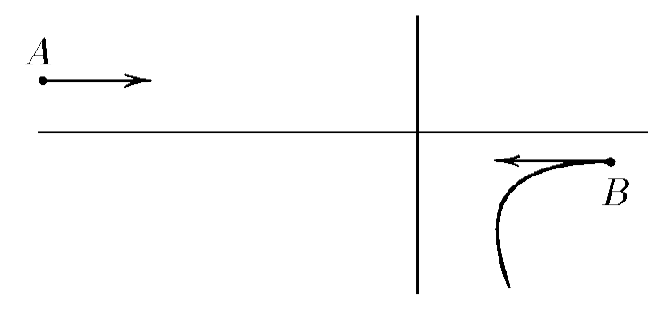

###  Условие:

$2.2.18.$ Две заряженные частицы массы $m$ и $2m$, имеющие равные по модулю импульсы, одновременно вылетают навстречу друг другу из точек $A$ и $B$. Частицы взаимодействуют только друг с другом. По траектории частицы массы $2m$, приведенной на рисунке, восстановите траекторию другой частицы

###  Решение:

Так как система состоит только из двух частиц и внешние силы отсутствуют, центр масс системы либо неподвижен, либо движется равномерно. Его положение можно вычислить как:

\[
x_{\text{см}} = \frac{m x_1 + 2m x_2}{m + 2m}
\]

где \(x_1\) и \(x_2\) — координаты частиц масс \(m\) и \(2m\).

Любое изменение движения одной частицы приводит к противоположным изменениям движения другой частицы с учётом их масс. Для каждой проекции:

\[
v_{m} = -2 v_{2m}
\]

Таким образом, траектория частицы массы \(m\) будет симметричной относительно центра масс системы, но с учетом соотношения импульсов частиц.

Чтобы восстановить траекторию частицы массы \(m\), необходимо в каждой точке траектории частицы массы \(2m\) отложить вектор скорости в два раза больший по величине и противоположный по направлению. Соединяя эти точки, получаем искомую траекторию.

На схематическом изображении это будет выглядеть следующим образом:

