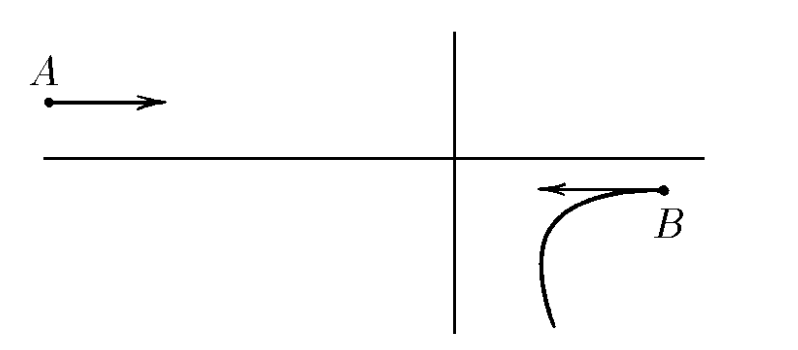
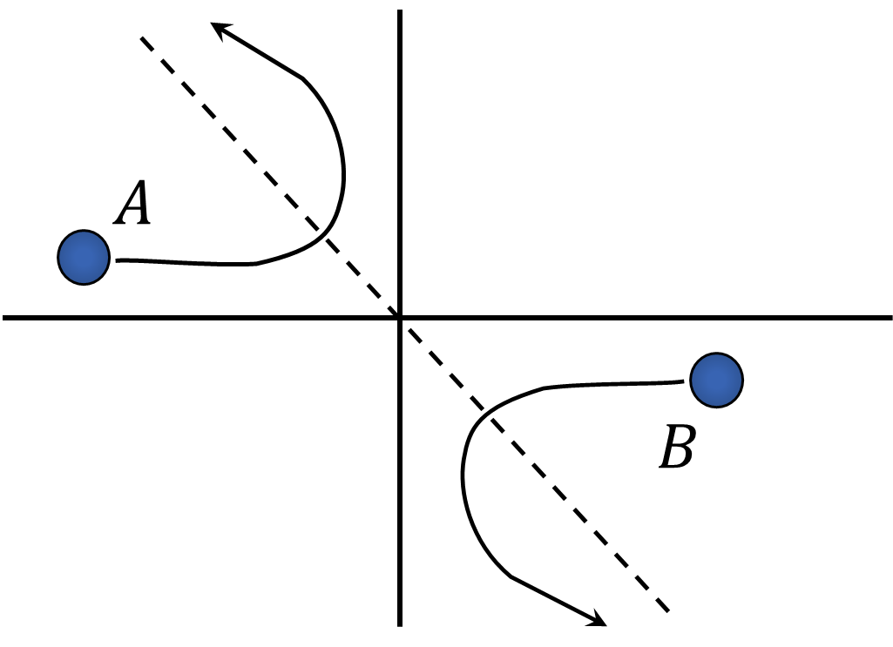

###  Условие: 

$2.2.18.$ Две заряженные частицы массы $m$ и $2m$, имеющие равные по модулю импульсы, одновременно вылетают навстречу друг другу из точек $A$ и $B$. Частицы взаимодействуют только друг с другом. По траектории частицы массы $2m$, приведенной на рисунке, восстановите траекторию другой частицы 

###  Решение: 

Т.к. система замкнута, внешних сил нет, то центр масс системы останется на месте или будет двигаться равномерно 

  Вторая частица полетит симметрично относительно центра масс 

Соответственно, любое изменение в вертикальных и горизонтальных проекциях скоростей тела $B$ будет сказываться в два раза большими(в силу разности масс) противоположными измениями у тела $A$ 

  

