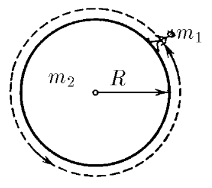

###  Условие: 

$2.2.19.$ Космическая станция представляет собой цилиндр радиуса $R$ и массы $m_2$. Космонавт массы $m_1$ начал круговой обход станции по ее поверхности. Определите траекторию космонавта и траекторию центра станции. Первоначально космонавт и станция неподвижны. 

###  Решение: 

Т.к. система замкнута, внешних сил нет, то центр масс системы останется на месте 

Расстояние от космонавта до центра масс найдем как $$x_c = \frac{0 \cdot m_1 + R \cdot m_2}{m_1+m_2}$$ Так как космонавт будет оставаться на поверхности цилиндической станции, то и траектория космонавта и траектория станции будет описана окружностями с центром в цетре масс системы 

Тогда радиус траектории-окружночти космонавта $$R_1 = R \frac{m_2}{m_1+m_2}$$ А корабля $$R_2 = R \frac{m_1}{m_1+m_2}$$ 

####  Ответ: 

Окружности, центр которых лежит в центре масс системы станция — космонавт. 

Радиусы окружностей: $$R_1 = R \frac{m_2}{m_1+m_2}$$ $$R_2 = R \frac{m_1}{m_1+m_2}$$

  

