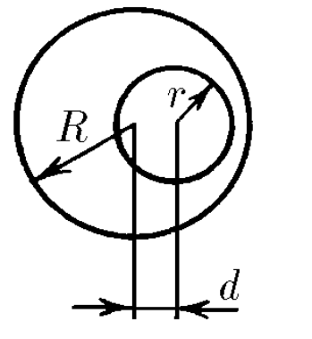
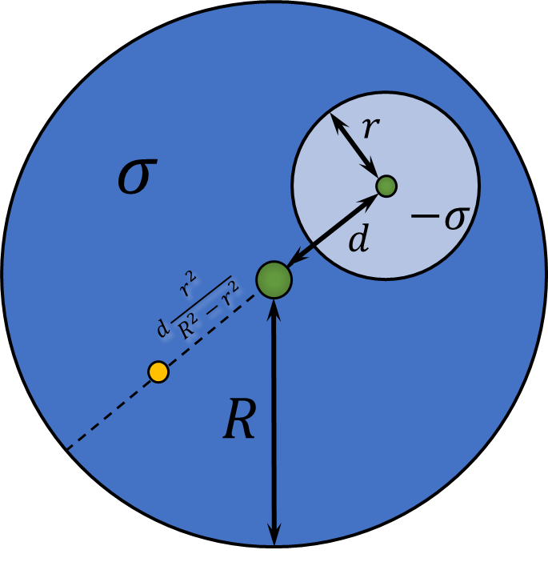

###  Условие: 

$2.2.20.$ Где находится центр масс: однородного прута, согнутого посередине под прямым углом? однородной треугольной пластинки? гардеробного номерка в виде диска с круглым отверстием? 

###  Решение: 

a) Найдем центр масс прямого угла 

  Центр масс прямого угла 

Центр масс будет отстаять от вершины угла по вертикали и горизантали на $$x_c =y_c = \frac{L}{4}$$ Откуда расстояние до вершины угла $$l = L \frac{\sqrt{2}}{4}$$ 

b) Перейдем к равностороннему треугольнику 

  Центр масс равностороннего треугольника 

Центр масс будет отстаять от каждой стороны на величину $$x_c = \frac{0 \cdot \frac{m}{3} + \frac{l}{6}\frac{\sqrt{3}}{2}\cdot \frac{m}{3}\cdot 2}{m}$$ $$x_c = \frac{l}{6\sqrt{3}}$$ И эта точка будет являться [центроидом](https://en.wikipedia.org/wiki/Centroid) треугольника 

c) Чтобы найти центр масс номерка, представим номерок как суперпозицию диска с поверхностной плотностью $\sigma$ на которого наложили диск с отрицательной плотностью $-\sigma$ 

  Центр масс номерка 

Найдем расстояния центра масс от центра номерка $$x_c = \frac{0 \cdot \sigma R^2 - d \sigma r^2}{\sigma R^2 - \sigma r^2}$$ Таким образом, расстояние на котором будет находиться центр масс номерка $$l = d \frac{r^2}{R^2 - r^2}$$ 

####  Ответ: 

На биссектрисе угла на расстоянии $l = L \sqrt{2}/4$, где $L$ — длина половины прута; 

в точке пересечения медиан; 

на прямой, соединяющей центры диска и отверстия, на расстоянии $l = dr^2/(R^2 − r^2)$ от центра диска. 

  

