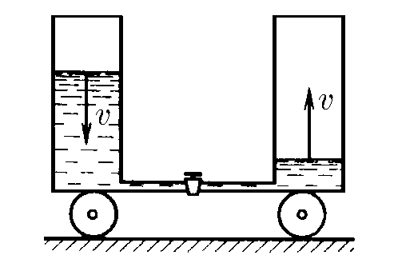

###  Условие: 

$2.2.21.$ На первоначально неподвижной тележке установлены два вертикальных цилиндрических сосуда, соединенных тонкой трубкой. Площадь сечения каждого сосуда $S$, расстояние между их осями $l$. Один из сосудов заполнен жидкостью плотности $\rho$. Кран на соединительной трубке открывают. Найдите скорость тележки в момент времени, когда скорость уровней жидкости равна $v$. Полная масса всей системы $m$. 

###  Решение: 

Т.к. система замкнута, то центр масс системы(относительно земли) с течением времени остается на месте 

Когда за малый промежуток времени $dt$, уровень воды в левом сосуде опустился на $udt$, масса воды в левом сосуде увеличилась на $$dm = uS\rho dt$$ Таким образом центр масс системы относительно тележки сместился на $$dx = l \frac{dm}{m}$$ Так как, относительно земли центр масс системы покоиться, то тележка сместилась в противоположном направлении на тоже расстояние $dx$. Откуда найдем сокрость тележки $$u = \frac{dx}{dt}$$ $$\boxed{u = \frac{\rho Svl}{m}}$$ 

####  Ответ: 

$$u = \frac{\rho Svl}{m}$$

  

