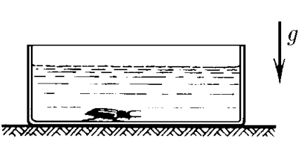

###  Условие:

$2.2.22^*.$ На гладком полу стоит сосуд, заполненный водой плотности $\rho_0$; объем воды $V_0$. Оказавшийся на дне сосуда жук объема $V$ и плотности $\rho$ через некоторое время начинает ползти по дну сосуда со скоростью $u$ относительно него. С какой скоростью станет двигаться сосуд по полу? Массой сосуда пренебречь, уровень воды все время остается горизонтальным.

###  Решение:

Т.к. система замкнута, то центр масс системы(относительно земли) с течением времени остается на месте

За малый промежуток времени $dt$ жук пройдет путь относительно дна сосуда

$$
dx = u dt
$$

Область объёма $V$ с плотностью $\rho$, которую занимал жук, теперь будет занимать вода с плотностью $\rho_0$

Учитывая, что общая масса системы равна

$$
M = \rho V + \rho_0V_0
$$

Получаем выражение для изменения координаты центра масс системы относительно аквариума

$$
dx_с = dx \frac{\rho_0V − \rho V}{\rho V + \rho_0V_0}
$$

Так как, относительно земли центр масс системы покоиться, то аквариум сместилась в противоположном направлении на тоже расстояние $dx_c$. Откуда найдем сокрость аквариума

$$
v = \frac{dx_c}{dt}
$$

$$
\boxed{v=u \frac{(\rho_0 − \rho )V}{\rho V + \rho_0V_0}}
$$

#### Ответ:

$$
v = uV \frac{\rho_0 − \rho}{\rho V + \rho_0V_0}
$$

###  Альтернативное решение:

