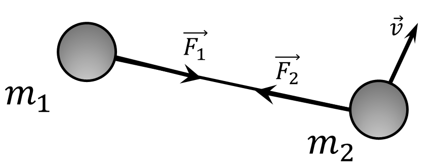

###  Условие: 

$2.2.24^*.$ Два тела массы $m_1$ и $m_2$ связаны натянутой нитью длины $l$ и движутся по гладкой горизонтальной поверхности. В некоторый момент времени оказалось, что первое тело неподвижно, а скорость второго тела, равная $v$, перпендикулярна нити. Определите силу натяжения нити. 

###  Решение: 

Рассмотрим эту систему как различные тела. Используя второй закон Ньютона, получаем: $$ \begin{cases} \vec{F}_1 = m_1 \vec{a}_1 \\\ \vec{F}_2 = m_2 \vec{a}_2 \end{cases} \Rightarrow \begin{cases} \vec{a}_1 = \frac{\vec{F}_1}{m_1} \\\ \vec{a}_2 = \frac{\vec{F}_2}{m_2} \end{cases} \quad \text{(1)} $$ Вычтем $\vec{a}_2$ из $\vec{a}_1$: $$ \vec{a}_1 - \vec{a}_2 = \frac{\vec{F}_1}{m_1} - \frac{\vec{F}_2}{m_2} \quad \text{(2)} $$ 

  Вычитание векторов 

Как мы видим, это похоже на производную от относительной скорости: $$ \vec{v}_{B/A} = \vec{v}_B - \vec{v}_A \quad \text{(3)} $$ Решаем производную: $$ \frac{d(\vec{v}_{B/A})}{dt} = \frac{d(\vec{v}_B)}{dt} - \frac{d(\vec{v}_A)}{dt} \Rightarrow \vec{a}_{B/A} = \vec{a}_B - \vec{a}_A \quad \text{(4)} $$ Вот почему мы можем сказать, что: 

$$ \vec{a}_1 - \vec{a}_2 = \vec{a}_{12} = \frac{\vec{F}_1}{m_1} - \frac{\vec{F}_2}{m_2} \quad \text{(5)} $$ 

Благодаря невесомости нити и третьему закону Ньютона $$\vec{F}_1 = -\vec{F}_2 = \vec{F}$$ В конечном счете: $$ \vec{a}_{12} = \vec{F} \left( \frac{1}{m_1} + \frac{1}{m_2} \right) = \vec{F} \frac{m_1 + m_2}{m_1 m_2} \quad \text{(6)} $$ $a_{12} = \frac{v^2}{l}$, где $l$ - длина нити, а $v$ - относительная скорость$\quad (7)$. $$ F = \frac{m_1 m_2}{m_1 + m_2} \frac{v^2}{l} \quad \text{(8)} $$ 

####  Ответ: 

$$F = \frac{m_1 m_2}{m_1 + m_2} \frac{v^2}{l}$$

  

