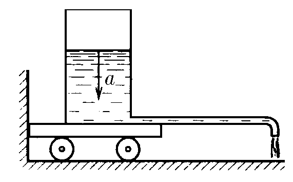

###  Условие:

$2.2.28^*.$ На тележке установлен цилиндрический сосуд с площадью сечения $S$, наполненный жидкостью плотности $\rho$. От сосуда параллельно полу отходит длинная и тонкая горизонтальная трубка, небольшой отрезок которой вблизи конца загнут по вертикали вниз. Расстояние от оси сосуда до отверстия трубки равно $L$. Уровень жидкости в сосуде опускается с ускорением $a$. Какой горизонтальной силой можно удержать тележку на месте?

###  Решение:

Поместим точку ноль горизонтальной оси под цилиндром. Запишем функцию изменения положения точки центра масс системы от времени:

$$
x_{c}(t) = \frac{L m(t)}{M},
$$

где $ m(t) $ – масса жидкости, вылившейся из сосуда на расстоянии $ L $, а $ M $ – полная масса жидкости.

$$
m(t) = h(t) S \rho
$$

где $ h(t) $ – уровень жидкости в сосуде, считая от верхней точки (т.е. $ h(0) = 0 $).

$$
h(t) = \frac{a t^2}{2}.
$$

Подставим одно в другое и получим:

$$
x_{c}(t) = \frac{L S \rho a t^2}{2 M},
$$

или

$$
x_{c}(t) = \frac{a t^2}{2},
$$

где $ a_{c} = \frac{L S \rho a}{M} $ – ускорение центра масс системы. Мы видим, что центр масс системы движется по оси $ x $ равноускоренно. Значит, его скорость меняется со временем по закону $ v_{c}(t) = a_{c} t $

Теперь мы можем сказать, как зависит от времени импульс системы:

$$
p(t) = M v_{c}(t). M = a_{c} M.
$$

Воспользуемся вторым законом Ньютона в импульсной форме, чтобы определить силу, в результате действия которой меняется импульс системы (единственная такая сила, действующая по оси $ x $ – это искомая сила реакции опоры).

$$
F = \frac{dp}{dt} = M a_{c} = \frac{L S \rho a}{M} M.
$$

Наконец, подставив выражение для $ a_{c} $, получим:

$$
F = \frac{L S \rho a}{M} M
$$

$$
\boxed{F = L S \rho a}
$$

####  Ответ:

$$
F = S\rho La
$$