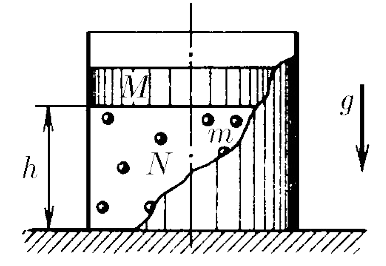

###  Условие: 

$2.2.32^*.$ В цилиндре под поршнем массы $M$ прыгают, упруго ударяясь о поршень и дно цилиндра, $N$ шариков массы $m$ каждый. Сила тяжести, действующая на поршень, уравновешена ударами шариков. Расстояние между дном цилиндра и поршнем равно $h$. Полная энергия каждого шарика одинакова. На какую высоту будут подскакивать шарики, если поршень быстро убрать? $N \gg 1$. 

###  Решение: 

NO: Эта задача была в одном из туров отборочных испытаний в Национальную сборную Республики Беларусь на Международную Физическую Олимпиаду 

Поршень не падает, потому что импульс, который передают ударяющиеся каждые $\Delta t$ секунд шарики, компенсирует силу тяжести, действующую на поршень $$Mg = N \frac{dp}{dt} \quad\text{(1)}$$ Т.к. удар абсолютно упругий, скорость шарика по модулю при ударе сохраняется, а по направлению меняется на противоположную $$dp = m(v - (-v)) = 2mv \quad\text{(2)}$$ Время между двумя последовательными соударениями одного шарика $\Delta t$ найдем из кинематических соображений $$v_0t - \frac{gt^2}{2} = H \quad\text{(3)}$$ $$v_0 - gt = v \quad\text{(4)}$$ $$v= \sqrt{v_0^2 - 2gh} \quad\text{(5)}$$ Из $\text{(3)}$ выразим $t$ $$t = \frac{v_0 - \sqrt{v^2_0-2gh}}{g} \quad\text{(6)}$$ Перепишем $\text{(1)}$ $$Mg = N \frac{2m\sqrt{v_0^2 - 2gh}}{2\frac{v_0 - \sqrt{v^2_0-2gh}}{g}} \quad\text{(7)}$$ $$M(v_0 - \sqrt{v^2_0-2gh}) = N m\sqrt{v_0^2 - 2gh} \quad\text{(5)}$$ $$Mv_0 = (M+N m)\sqrt{v_0^2 - 2gh} \quad\text{(8)}$$ Возводим обе части в квадрат $$M^2v_0^2 = (M+N m)^2(v_0^2 - 2gh) \quad\text{(9)}$$ Откуда находим скорость: $$v_0 = \sqrt{2gh\frac{(M+Nm)^2}{Nm(Nm+2M)}} \quad\text{(10)}$$ Из закона сохранения энергии, шарик запущенный со скоростью $v_0$ с поверхности земли достигнет максиму своего полета на высоте $$H=\frac{v_0^2}{2g} \quad\text{(11)}$$ $$\boxed{H=h\frac{(M+Nm)^2}{Nm(Nm+2M)}} \quad\text{(12)}$$ 

####  Ответ: 

$$H=h\frac{(M+Nm)^2}{Nm(Nm+2M)}$$

  

