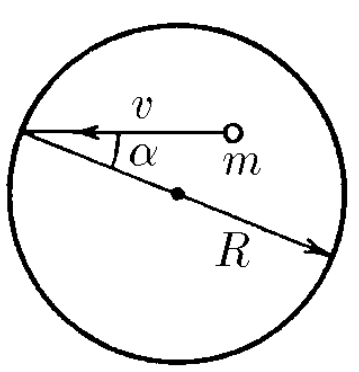

###  Условие:

$2.2.33^*.$ Внутри сферы радиуса $R$ со скоростью $v$ движется частица массы $m$, упруго ударяясь о ее стенки. Скорость частицы образует угол $\alpha$ с радиусом, проведенным в точку удара. Какова по модулю средняя сила, действующая со стороны стенок сферы на частицу? Какова средняя сила, действующая на единицу площади сферы, если в единице объема содержится $N$ таких частиц? Частицы между собой не сталкиваются.

###  Решение:

Импульс, который передает частица найдем как

$$
dp = 2mv\cos\alpha
$$

Путь, который пройдет частица между двумя последовательными ударами

$$
x = 2R\cos\alpha
$$

Таким образом время между двумя последовательными ударами

$$
dt = \frac{x}{v} = \frac{2R\cos\alpha}{v}
$$

Запишем второй закон Ньютона в импульсной форме

$$
F = \frac{dp}{dt} = 2mv\cos\alpha\frac{v}{2R\cos\alpha}
$$

$$
\boxed{F = \frac{mv^2}{R}}
$$

Количество частиц в единице объема обозначим за $N$, тогда количество частиц в сфере радиуса $R$ составляет

$$
n = \frac{4}{3} \pi r^3 N \tag{1}
$$

Общая сила действующая на стенки сферы:

$$
F = n\frac{mv^2}{R} \tag{2}
$$

А давление по определию - сила, действующая на единицу площади

$$
p = \frac{F}{4\pi R^2}
$$

Подставляем $\text{(1)}$ и $\text{(2)}$

$$
p = \frac{4}{3} \pi r^3 N \frac{mv^2}{4\pi R^3}
$$

$$
\boxed{p = \frac{Nmv^2}{3}}
$$

#### Ответ:

$$
F = \frac{mv^2}{R}
$$

$$
p = F/S = \frac{Nmv^2}{3}
$$