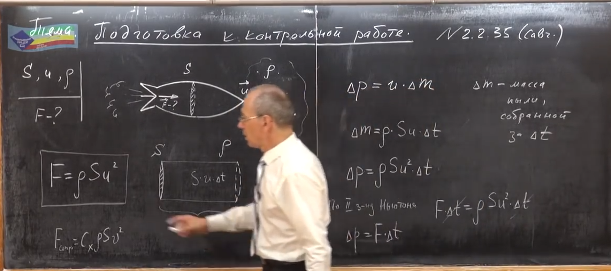

###  Условие:

$2.3.35.$ Ракета сечения $S$, двигаясь в космическом пространстве со скоростью $u$, попадает в облако неподвижной пыли плотности $\rho$. Какую силу тяги должны развивать двигатели ракеты, чтобы та могла продолжать двигаться с той же постоянной скоростью? Удары пылинок о ракету считать абсолютно неупругими. Изменением массы ракеты пренебречь.

###  Решение:

#### Ответ: $F = \rho Su^2$