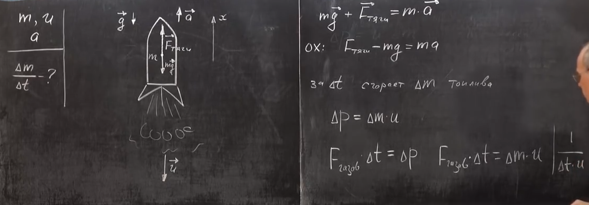
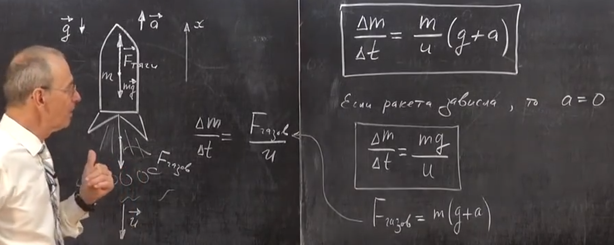

###  Условие:

$2.2.36.$ Ракета массы $m$ зависла над поверхностью Земли. Сколько топлива в единицу времени она должна расходовать при этом, если скорость истечения газа $u$? Как изменится результат, если ракета поднимается с ускорением $a$?

###  Решение:

###  Ответ: $\mu = M g/u;$ $\mu ' = M(g + a)/u$