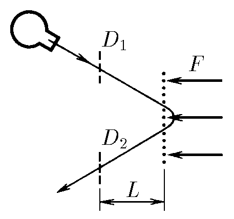

###  Условие:

$2.2.4.$ В масс-пролетном спектрометре источник испускает сгусток заряженных частиц, которые сначала летят свободно и пролетают через первый датчик $D_1$, находящийся на расстоянии $L$ от сетки. За сеткой по нормали к ней на частицы действует электрическая сила $F$. Частицы поворачиваются и вылетают через сетку назад, пролетая через второй датчик $D_2$, находящийся на том же расстоянии от сетки. От напряжения источника зависит скорость вылетающих частиц, но точное ее значение остается неизвестным. Меняя напряжение, измеряют время между срабатываниями датчиков и находят наименьшее его значение $\Delta t$. Какова масса частицы? Как можно найти массу частиц, если источник испускает несколько сортов частиц с разной массой?

###  Решение:

Время пролета расстояния $2L$

$$
t_1 = \frac{2L}{v_0}
$$

Время разворота частицы

$$
t_2 = 2\frac{mv_0}{F}
$$

Зависимость времени от скорости частицы

$$
t(v) = \frac{2L}{v_0} + 2\frac{mv_0}{F}
$$

Находим производную времени по скорости и ищем экстремум(из условия минимума $\Delta t$)

$$
\frac{dt}{dv} = 2\frac{m}{F} - \frac{2L}{{v_0}^2} = 0
$$

отсюда

$$
v_0 = \sqrt{\frac{FL}{m}}
$$

тогда

$$
t_1 =t_2 = 2\sqrt{\frac{mL}{F}},
$$

$$
\Delta t = 4\sqrt{\frac{mL}{F}}
$$

Выражаем массу частицы

$$
\Delta t = 4\sqrt{\frac{mL}{F}} \Rightarrow \boxed{m = \frac{F{\Delta t}^2}{16L}}
$$

###  Ответ:

$$
m=\frac{F{\Delta t}^2}{16L}
$$