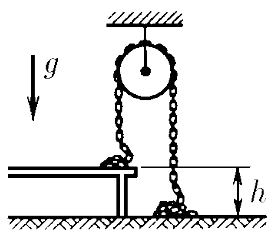
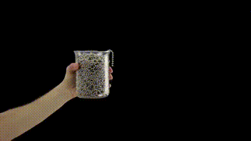

###  Условие: 

$2.2.43.$ Цепь с неупругими звеньями перекинута через блок, причем часть ее лежит на столе, а часть — на полу. После того как цепь отпустили, она начала двигаться. Найдите скорость установившегося равномерного движения цепи. Высота стола $h$. 

###  Решение: 

 

__NO__: Эта задача очень напоминает по своей формулировке задачу о [Фонтанирующей цепочки](https://en.wikipedia.org/wiki/Chain_fountain) более подробрнее на [сайте сборной России](https://pho.rs/p/107)

Движение цепи обусловлено изменением положения центра масс участка, соответствующего высоте стола $h$. Если за нулевой уровень потенциальной энергии принять пол, то центр масс этого участка цепи расcположен на расстоянии $\frac{h}{2}$ от пола 

Таким образом, величина кинетической энергии цепи при её движении будет определяться потенциальной энергией центра масс участка цепи протяжённостью $h$ $$\frac{mv^2}{2} = mg\frac{h}{2}$$ 

Откуда находим исскомую скорость конца цепочки $$\boxed{v = \sqrt{gh}}$$ 

####  Ответ: 

$$v = \sqrt{gh}$$

  

