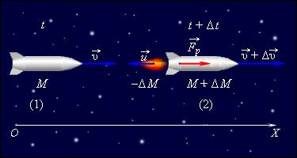

###  Условие:

$2.2.47^*.$ Скорость газа, выбрасываемого ракетой, относительно нее равна $u=2 \text{ км/с}$. Оцените начальную массу ракеты, которая может вывести на орбиту Земли спутник массы $M_2=10^4 \text{ кг}$. Как изменится результат при вдвое большей скорости истечения газа?

###  Решение:

Запишем закон сохранения импульса за малый промежуток времени

$$
Mv = (M+dm)(v+dv) - dm(v+u)
$$

$$
Mv = Mv + dmu + mdv
$$

$$
dmu = -mdv
$$

Откуда получаем соотношение

$$
-\frac{dm}{m} = \frac{dv}{u}
$$

Интегрируем обе части уравнения

$$
-\int_{M_1}^{M_2}\frac{dm}{m} = \int_{v_1}^{v_2}\frac{dv}{u}
$$

$$
\boxed{\ln \frac{M_1}{M_2} = \frac{\Delta{v}}{u}} \quad\text{(1)}
$$

Это уравнение называется [формулой Циалковского](https://en.wikipedia.org/wiki/Tsiolkovsky_rocket_equation)

Чтобы вывести тело на орбиту, ему необходимо задать первую космическую скорость

$$
v = \Delta v = \sqrt{G\frac{M}{R}} = 7.9 \text{ км/с}
$$

Подставляем в $\text{(1)}$ и получаем $M_2$

$$
M_1 = M_2 e^{\frac{v}{u}} = 5.2 \cdot 10^5 \text{ кг}
$$

####  Ответ:

$m \approx 5.5 \cdot 10^5 \text{ кг};$ в $7.4$ раза меньше