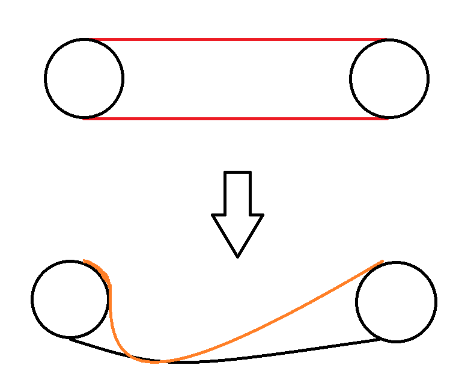

###  Условие:

$2.2.8.$ Человек решил бежать по резиновой ленте, натянутой на двух горизонтальных роликах, трения в осях которых нет. На первый взгляд кажется, что это невозможно: человек не может передать импульс ни ленте, ни роликам, так как их полный импульс равен нулю. Следует ли из этого, что человек останется на месте?

###  Решение:

Чтобы оттолкнуться можно использовать натяжение сразу двух резинок, таким образом можно будет от них оттолкнуться, ведь натяжение будет препятствовать их прокручиванию.

#### Ответ: Да, можно.