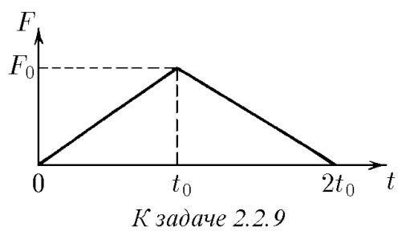

###  Условие: 

$2.2.9^*.$ На покоящееся тело массы $m_1$ налетает со скоростью $v$ тело массы $m_2$. Сила, возникающая при взаимодействии тел, линейно зависящая от времени, растет от нуля до значения $F_0$ за время $t_0$, а затем равномерно убывает до нуля за то же время $t_0$. Определите скорость тел после взаимодействия, считая, что все движения происходят по одной прямой. 

###  Решение: 

Из народной приметы известно, что  $Fdt = dp$ $ \int\limits_0^t F(t)dt = \Delta p$  в нашем случае:  $\int\limits_0^{2t_0} F(t)dt = F_0 t_0 = \Delta p$  Так как первое тело покоилось, то  $mv_1 = \Delta p$ $v_1 = \frac{F_0 t_0}{m_1}, $  на второе тело сила действует в обратную сторону, соответственно уменьшая импульс, тогда  $m_2 v_2 = m_2 v - F_0 t_0$ $ v_2 = v - \frac{F_0 t_0}{m_2}$ 

###  Ответ: $u_1 = F_0t_0/m_1;$ $u_2 = v − F_0t_0/m_2$ 
