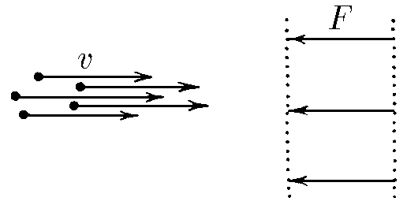

###  Условие:

$2.3.1.$ Пучок заряженных частиц различной массы, имеющих одну и туже скорость $v$, направили по нормали к двум сеточным электродам, между которыми на каждую частицу действует одна и та же сила $F$. При какой наименьшей массе частиц в пучке все они достигнут второй сетки, если ширина зазора между электродами равна $\ell$?

###  Решение:

По условию задачи требуется найти наименьшую массу частиц в пучке при которой все они достигнут второй сетки. Тогда работа силы между сеточными электродами на расстоянии $\ell$ равна изменению кинетической энергии частиц

$$
F\ell = \Delta E_k = \frac{mv^2}{2},
$$

здесь учтено, что работа силы $F$ отрицательна, а изменение кинетической энергии

$$
\Delta E_k = 0 - \frac{mv^2}{2}
$$

Тогда минимальная масса частиц

$$
m = \frac{2F\ell}{v^2}.
$$

__Примечание:__ задачу можно решить динамически, через импульс силы. Попробуйте самостоятельно прийти к ответу.

#### Ответ: наименьшая масса частиц, когда они достигнут второй сетки равна $m = \frac{2F\ell}{v^2}$