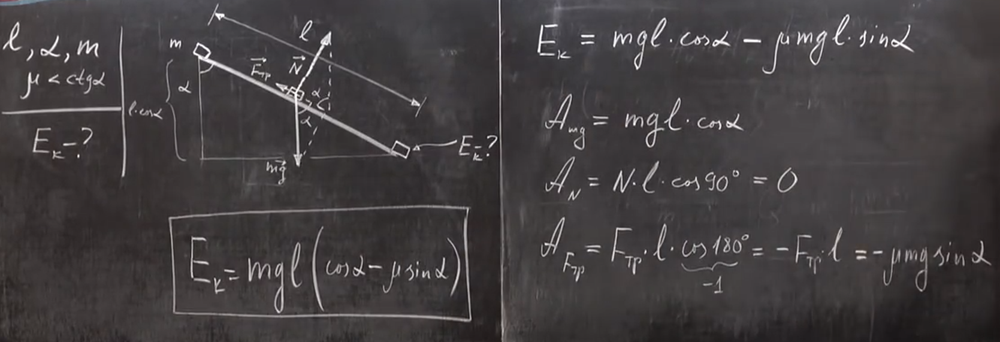

###  Условие: 

$2.3.11.$ С верхнего конца доски длины $l$, образующей угол $\alpha$ с вертикалью, начинает соскальзывать тело массы $m$. Какую кинетическую энергию оно приобретет, дойдя до нижнего конца доски? Рассмотрите случай отсутствия трения и случай, когда коэффициент трения между телом и доской $\mu < c\tan\alpha $. 

###  Решение: 

 

 

####  Ответ: $K = mgl \cos\alpha ;$ $K_0 = mgl(\cos\alpha − \mu\,\sin\alpha )$ 
