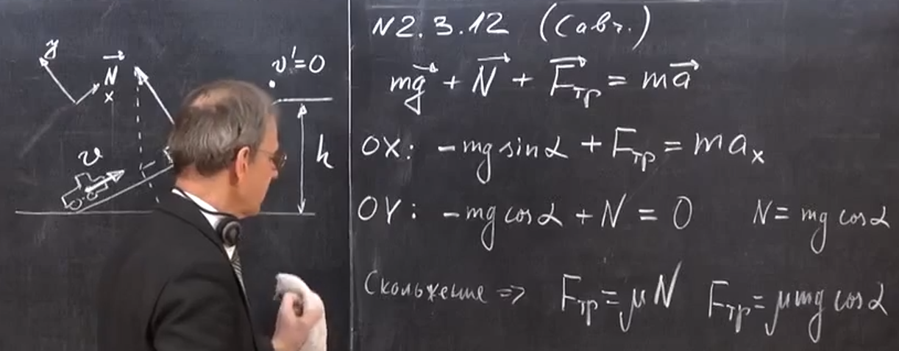
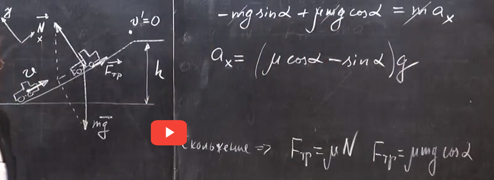
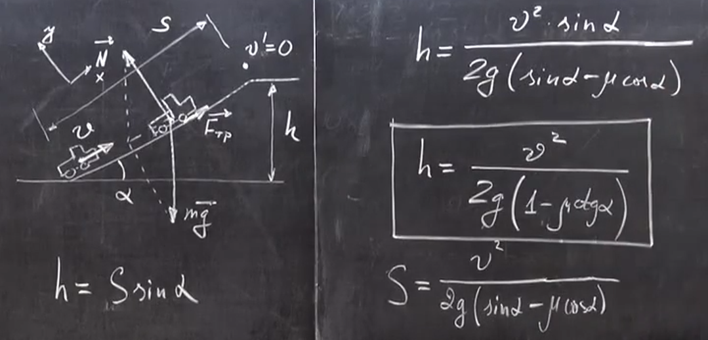

###  Условие:

$2.3.12.$ Автомобиль с работающим двигателем въезжает на обледенелую гору, поверхность которой образует угол $\alpha$ с горизонтом. Какой высоты гору может преодолеть автомобиль, если его начальная скорость при въезде на нее равна $v$, а коэффициент трения колес о лед $\mu < \tan\alpha $?

###  Решение:

###  Ответ: $h = v^2/[2g(1 − \mu\,c\tan\alpha )]$