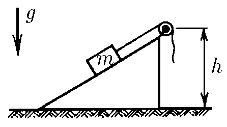

###  Условие:

$2.3.13.$ Груз массы $m$ медленно поднимают на высоту $h$ по наклонной плоскости с помощью блока и троса. При этом совершается работа $A$. Затем трос отпускают, и груз скользит вниз. Какую скорость он наберет, опустившись до исходной точки?

###  Решение:

1\. Поскольку груз поднимают посредствам подвижного блока, то действующая сила равна половине нагрузки. Кроме того, во время спуска против неизвестных сил сопротивления будет затрачена работа $A$.

2\. Если принять за нулевой уровень потенциальной энергии поверхность земли, то закон сохранения в данном случае можно представить в виде.

$$
\frac{mv^2}{2}=2mgh-A
$$

Откуда, выражаем скорость, которую груз наберет, опустившись до исходной точки

$$
v =\sqrt{4gh − 2A/m}
$$

####  Ответ: $v =\sqrt{4gh − 2A/m}$