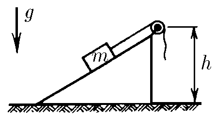

###  Условие:

$2.3.13.$ Груз массы $m$ медленно поднимают на высоту $h$ по наклонной плоскости с помощью блока и троса. При этом совершается работа $A$. Затем трос отпускают, и груз скользит вниз. Какую скорость он наберет, опустившись до исходной точки?

###  Решение:

Разница работы трения и работы подъёма может выражаться как изменение потенциальной энергии:
$$
A-A_\text{f}=mgh
$$
После начала движения с вершины трение выполняет ту же работу. Запишем закон сохранения энергии:
$$
A_\text{f}+\frac{mv²}{2}=mgh
$$
Подставим работу трения, выразив кинетическую энергию:
$$
\frac{mv^2}{2}=2mgh-A
$$

Откуда, выражаем скорость, которую груз наберет, опустившись до исходной точки

$$
v =\sqrt{4gh − 2A/m}
$$

#### Ответ
$v =\sqrt{4gh − 2A/m}$