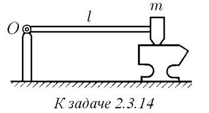

###  Условие: 

$2.3.14.$ Средневековый поворотный молот имеет тяжелый боек массы $m$ на конце легкого стержня длины $l$. Его приводят из горизонтального в почти вертикальное положение, поворачивая вокруг оси, проходящей через другой конец стержня. Какую наименьшую работу нужно совершить, чтобы поднять молот? Трением в оси пренебречь. 

###  Решение: 

Работа $A_{min}$ будет потрачена только на увеличение потенциальной энергии бойка на высоту $h=l$.  $A_{min}=mgl$ 

###  Ответ: $A_{min}=mgl$ 

### 
