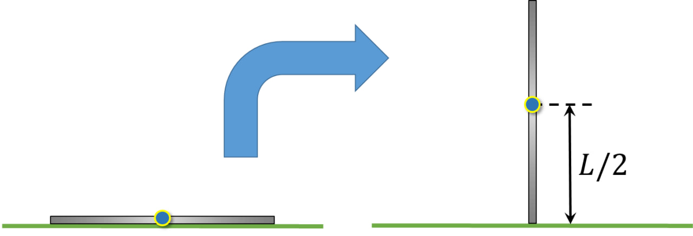

###  Условие:

$2.3.15.$ Какую наименьшую работу нужно совершить, чтобы лежащий на земле длинный однородный столб длины $l$ и массы $m$ поставить вертикально?

###  Решение:

Работа пойдет на увеличение потенциальной энергии центра масс на высоту $h=\frac{L}{2}$:

$$
A=mg\frac{L}{2}
$$

####  Ответ: $A=mg\frac{L}{2}$