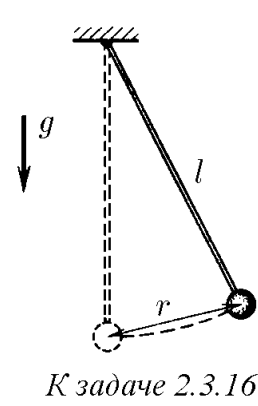

###  Условие: 

$2.3.16.$ Грузик, подвешенный на нити длины $l$, отклонили на расстояние $r$ от точки равновесия и отпустили. Какова его наибольшая скорость? 

###  Решение: 

 

Рассмотрим геометрию системы:  $BC=AD \cdot (1-\cos 2\alpha )=CD \cdot \sin\alpha$ $l \cdot (1-\cos 2\alpha )=r \cdot \sin\alpha$ $1-\cos 2\alpha =2\sin^2 \alpha$ $2l \cdot\sin^2\alpha =r \cdot \sin\alpha$ $\sin\alpha =\frac{r}{2l}\quad(a)$  Из закона сохранения энергии:  $E=E_{кин}+E_{пот}$  $E_{кин}$ будет максимальна при минимальной $E_{пот}$ в точке $C$  $E_{кин}=mgr\,\sin\alpha$ $\frac{mv_{max}^2}{2}=mgr\,\sin\alpha$ $\frac{v_{max}^2}{2}=gr\,\sin\alpha$ $v_{max}=\sqrt{2gr\,\sin\alpha}$  Подставляем $(a)$:  $v_{max}=\sqrt{2g\,\frac{r^2}{2l}}$ $v_{max}=r\sqrt{\frac{g}{l}}$ 

###  Ответ: $v_{max}=r\sqrt{\frac{g}{l}}$ 

### 
