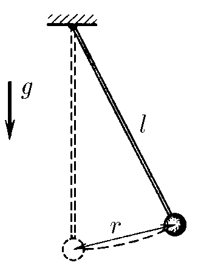
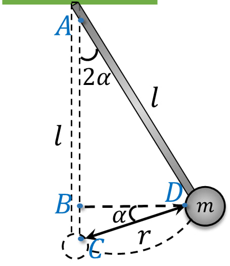

###  Условие:

$2.3.16.$ Грузик, подвешенный на нити длины $l$, отклонили на расстояние $r$ от точки равновесия и отпустили. Какова его наибольшая скорость?

###  Решение:

Рассмотрим геометрию системы:

$$
BC=AD \cdot (1-\cos 2\alpha )=CD \cdot \sin\alpha
$$

$$
l \cdot (1-\cos 2\alpha )=r \cdot \sin\alpha
$$

Воспользуемся тригонометрическим преобразованием $(1-\cos 2\alpha =2\sin^2 \alpha):$

$$
2l \cdot\sin^2\alpha =r \cdot \sin\alpha
$$

Откуда выражаем значение для половины угла отклонения $\alpha$

$$
\sin\alpha =\frac{r}{2l}\tag{a}
$$

Из закона сохранения энергии:

$$
E=E_\text{кин}+E_{пот}
$$

$E_\text{кин}$ будет максимальна при минимальной $E_{пот}$ в точке $C$, т.к. потенциальная энергия будет минимальной

$$
\frac{mv_\text{max}^2}{2}=mgr\,\sin\alpha
$$

Сокращаем на массу грузика $m$

$$
\frac{v_\text{max}^2}{2}=gr\,\sin\alpha
$$

Откуда выражаем наибольшую скорость грузика

$$
v_\text{max}=\sqrt{2gr\,\sin\alpha} \tag{b}
$$

Подставляем угол $\alpha$ из $(a)$ в выражение $(b)$:

$$
v_\text{max}=\sqrt{2g\,\frac{r^2}{2l}}=r\sqrt{\frac{g}{l}}
$$

#### Ответ: $v_\text{max}=r\sqrt{\frac{g}{l}}$