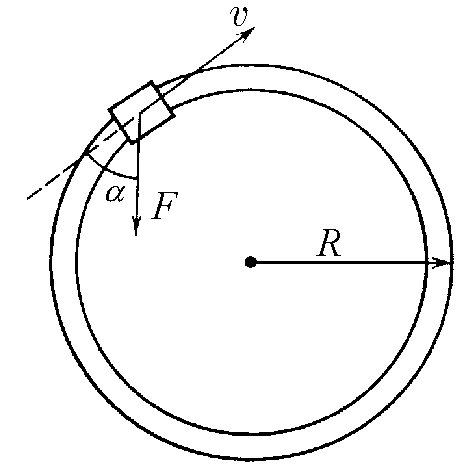

###  Условие:

$2.3.17.$ По рельсам, образующим горизонтальный круговой путь радиуса $R$, катится со скоростью $v$ вагонетка массы $m$. Рабочий бежит за ней и начинает останавливать ее, натягивая привязанный к вагонетке трос с силой $F$ под углом $\pi − \alpha$ к направлению скорости вагонетки. Сколько оборотов по кругу совершит вагонетка до остановки? Трением пренебречь.

###  Решение:

Вагонетка остановится, когда вся кинетическая энергия будет израсходована на работу силы $F$. причём пройденный до остановки путь будет являться верхним пределом интеграла работы $(A=\int Fdr)$.

$$
\frac{mv^2}{2}=F\cos\alpha\cdot \int_{0}^{2\pi nR}dr
$$

Проводя суммирование на выбранном промежутке

$$
\frac{mv^2}{2}=F\cos\alpha\cdot 2\pi nR
$$

Откуда количество оборотов по кругу до остановки

$$
n=\frac{mv^2}{4 F\cos\alpha\cdot \pi R}
$$

где $n$ — искомое число полных оборотов вагонетки до остановки.

####  Ответ: $n=\frac{mv^2}{4 F\cos\alpha\cdot \pi R}$